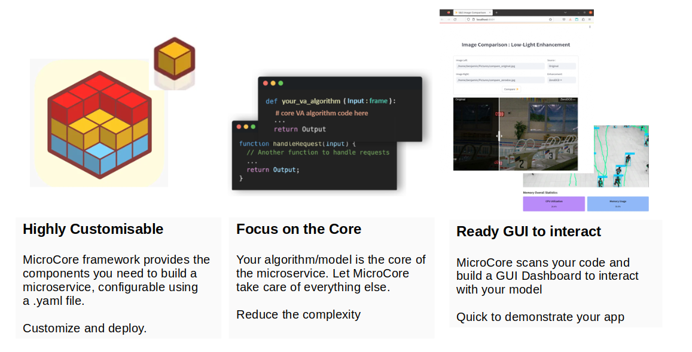
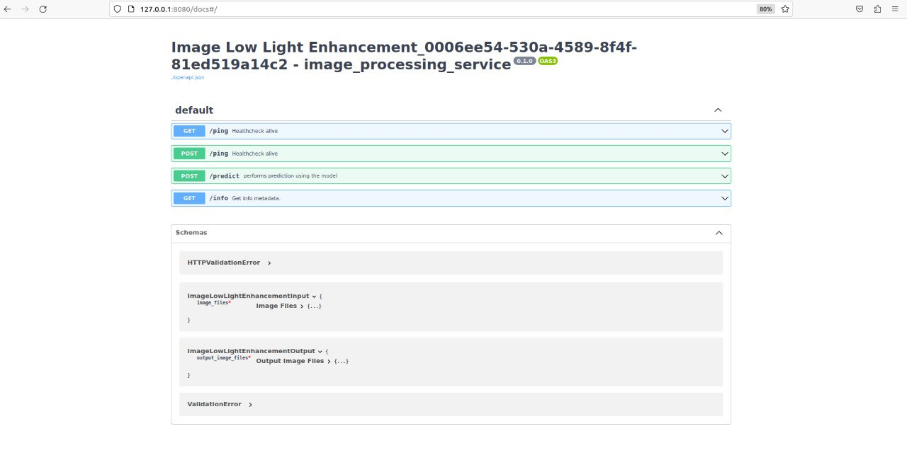
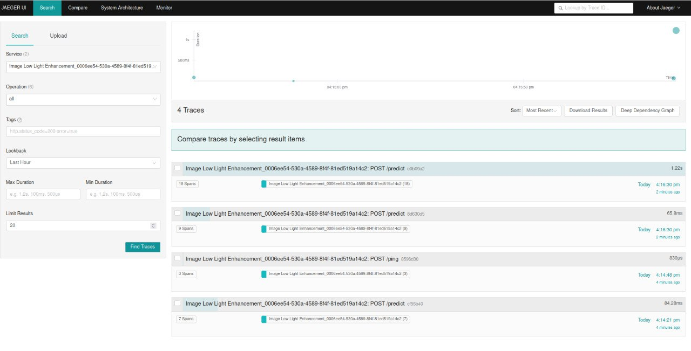
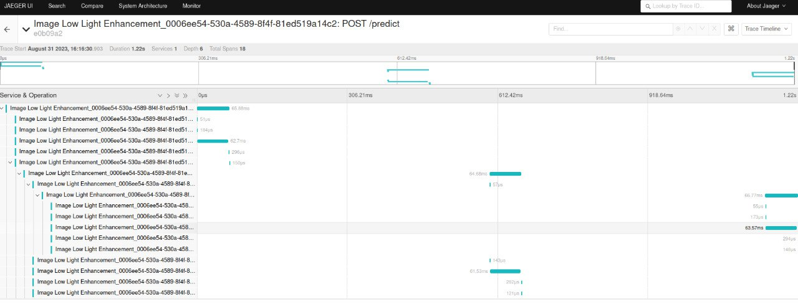

<!-- markdownlint-disable MD033 MD041 -->
<div style="text-align: center;">
  
</div>
<br>
<p align="center">
    <span><strong>Micro</strong> -<small><i>tailored for microservices.  </small></i><strong>Core</strong> - <small><em>algorithm model centric </small></em></span><br><br>
    <strong>A Python Framework to build microservice.</strong>
</p>

## Why <span style="color:lightblue;"> MicroCore </span> ?

Developers routinely grapple with boilerplate code and server, sinking valuable time into these repetitive tasks when building microservices.

Moreover, efforts across different projects to build microservices are often fragmented, leading to duplicated work and inefficiencies. 

MicroCore's aim is to consolidate the collective expertise of developers into a singular, feature-rich framework that is not only robust and reliable but also rigorously tested to meet real-world challenges.



---

## Benefits of using MicroCore

- Rapidly build production-ready microservices using code/algorithm/model functions.
- Auto-generate API endpoints with API-docs
- Configurable through config file, to prefine features such as  interfaces (REST API/Kafka), run-modes (CLI/GUI, Batch/RealTime)
- Logging & Monitoring using OpenTelemetry 
- (in-progress) Automatically load pre-defined GUI templates for interaction.
- (in-progress) Docker Export
- (in plans) Internal watchdog and health monitoring
- (in plans) Adminstration with activity and performance metrics stored in sqlite Database.
- (in plans) Microservices Security and Authentication such as Token-Based Authentication(JWT/oAuth2.0), Role-Based Access Control,Data Encryption and Audit, Rate limiting against DDoS.

## ⏰ Status

| Status | Feature(s) | Goal |
| ------ | ------ | ---- |
| In-progress | Alpha | Implementation of core features including communication interfaces (API/KAFKA), Logging & Monitoring, deployment using config |
| ❏ | Dockerisation | Samples to dockerise a model/algorithm

## 🔖 Installation

- [Python](https://www.python.org/) version 3.8+

- Install using `pip`:
    <details>
    <summary>from Gitlab repo (click to expand...)</summary>

    ```bash
    pip install git@sgts.gitlab-dedicated.com:wog/htx/s-s-coe/htx-inxeption/MicroCore.git
    ```
    </details>
    <details>
    <summary>from source code (click to expand...)</summary>

    ```bash
    pip install <your_directory>/Micro_core
    ```
    </details>
    <details>
    <summary>from .whl file (click to expand...)</summary>

    ```bash
    #Download the wheel file from the repository release page.
    pip install MicroCore_v1.0.whl
    ```
    </details>
## Examples
The following collection of examples demonstrate how MicroCore can support a variety of use-cases:

#### Image Enhancement (Low Light)
- 📄&nbsp; [Source Code](examples/enhancement_lowlight/app.py)
- 🌅&nbsp; [UI Demo](coming soon)

#### Audio Enhancement (Pitch Adjustment)
- 📄&nbsp; [Source Code](examples/enhancement_audio_pitch/app.py)
- 🌅&nbsp; [UI Demo](coming soon)

#### Video Enhancement (coming soon)
- 📄&nbsp; Nothing here

## Features

<p align="center">
  <a href="#core">CORE</a> •
  <a href="#http-api">HTTP API</a> •
  <a href="#gui">GUI</a> •
  <a href="#opentelemetry">OpenTelemetry</a> •
  <a href="#docker-export">Docker Export</a> 
</p>

### CORE

The core of every microservices built with MicroCore framework, is a template function that fulfills the following requirements:

- A single parameter called `input` which MUST be a subclass of the [Pydantic BaseModel](https://pydantic-docs.helpmanual.io/usage/models/).
- A single return `value` that MUST be a subclass of the [Pydantic BaseModel](https://pydantic-docs.helpmanual.io/usage/models/).
- The `input` parameter and return `value` MUST be annotated with Python typing hints.

### HTTP API

With MicroCore, you can instantly launch a local HTTP (REST) API server for any [compatible function](#compatible-functions):

```bash
#through function call in code
instance_core = MicroCore(your_function)
launch_api(instance_core,port,hostname)
```

This will launch a [FastAPI](https://fastapi.tiangolo.com/) server based on the [OpenAPI standard](https://swagger.io/specification) and with an automatic interactive documentation.



_💡 Go to your microservice "http://hostname:port/docs#/" to checkout the API endpoints ._

### GUI
`Coming soon`

### OpenTelemetry
OpenTelemetry is an open-source tool for monitoring and tracing applications. It's useful for FastAPI to trace requests and responses, revealing bottlenecks, while for Kafka, it traces the flow of messages to monitor processing times and detect issues. <br><br>
To visualize the collected data, you can integrate OpenTelemetry with Jaeger, an open-source distributed tracing system, to gain insights into how your applications behave.

Checkout the repository [wiki](comingsoon) for the guide to monitor your microservices using dockerised Jaeger.
<div style="display: flex; justify-content: space-between;">
  
  
</div>

### Docker Export
`Coming soon` <br>
MicroCore provides the capability to export to a Docker image:
```bash
MicroCore export <your_microserice_app_folder> --format=docker my-microserice:latest
```
_💡 The Docker export requires that Docker is installed on your machine._

After the successful export, the Docker image can be run as shown below:

```bash
docker run -p <your_port>:<your_port> my-microserice:latest
```